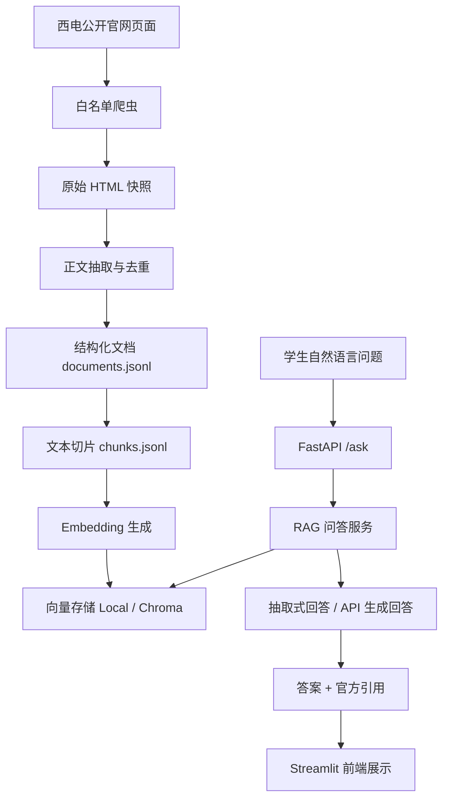

# 西电官网数据 RAG 智能检索系统项目启动与规划

## 1. 团队组建与角色分配

### 1.1 项目目标

本项目拟建设一个面向西安电子科技大学学生的官网数据 RAG 智能检索系统。系统采集学校公开官网页面，清洗并构建本地知识库，支持学生用自然语言查询学校政策、推免/保研、生活安排、竞赛通知、教务信息、学工通知等内容，并返回带官方来源引用的答案。

首版系统以“可运行、可演示、来源可信、拒绝无依据回答”为核心目标，避免模型编造未被官方资料支持的内容。

### 1.2 团队角色
陈天路：网站全栈开发
杨昊炜 王思帆：进行网站测试 配置API
纪依程 温阳：知识库获取 文档编写
### 1.3 协作机制

- 任务管理工具：Plane。
- 代码管理：Git，本地开发后统一合并到主分支。

## 2. 产品 Backlog（Plane）

### 2.1 Plane 项目配置建议

项目名称：XDU_RAG
工作流状态：

| 状态 | 含义 |
| --- | --- |
| Backlog | 已记录但暂未进入迭代 |
| Todo | 本迭代计划完成 |
| In Progress | 正在开发或整理 |
| In Review | 已完成，等待评审/测试 |
| Done | 已验收完成 |

模块标签：

- `需求分析`
- `数据采集`
- `知识库`
- `RAG问答`
- `后端API`
- `前端界面`
- `测试`
- `UML建模`
- `文档`

### 2.2 Epic 与用户故事

#### Epic 1：需求分析与项目建模

| Plane Issue | 类型 | 估算 | 描述 | 验收标准 |
| --- | --- | ---: | --- | --- |
| 明确目标用户与使用场景 | Story | 2 | 梳理学生查询政策、保研、生活、竞赛、教务、学工信息的典型场景 | 文档中包含目标用户、核心痛点、主要使用场景 |
| 编写功能性与非功能性需求 | Story | 3 | 明确系统必须支持的功能和质量要求 | 形成需求列表，覆盖采集、检索、问答、引用、拒答、前端展示 |
| 绘制 UML 用例图 | Task | 2 | 使用 UML 工具绘制学生、系统管理员与系统的交互 | 用例图包含问答查询、分类筛选、更新知识库、查看引用等用例 |
| 绘制 UML 类图/组件图 | Task | 3 | 展示核心模块关系，如爬虫、切片、向量存储、问答服务、API | 图中体现主要类/组件及依赖关系 |

#### Epic 2：官网数据采集与清洗

| Plane Issue | 类型 | 估算 | 描述 | 验收标准 |
| --- | --- | ---: | --- | --- |
| 维护官网数据源白名单 | Story | 2 | 配置西电主站、综合信息网、信息公开网、教务处、研究生院、学生工作部等官方站点 | `config/sources.json` 中包含允许域名、种子 URL 和默认分类 |
| 实现网页抓取与失败记录 | Story | 5 | 按白名单抓取公开页面，并记录无法访问页面 | 可执行 `xidian-rag crawl --max-pages 120`，失败项写入日志 |
| 保存原始 HTML 快照 | Task | 2 | 保存抓取到的原始页面，便于复现和离线导入 | 原文写入 `data/knowledge_base/pages/` |
| 实现 HTML 正文抽取 | Story | 5 | 从网页中抽取标题、正文、发布时间、链接等信息 | 生成结构化 `data/documents.jsonl`，短文本和重复文本会被过滤 |
| 支持手动导入 HTML 原文 | Story | 3 | 允许把网页原文放入目录后离线生成文档 | `xidian-rag ingest-pages` 能从本地 HTML 生成文档 |

#### Epic 3：知识库构建与检索

| Plane Issue | 类型 | 估算 | 描述 | 验收标准 |
| --- | --- | ---: | --- | --- |
| 实现文本切片 | Story | 3 | 将长文档切分为适合检索的文本块 | 生成 `data/chunks.jsonl`，短文本保留，长文本合理切分 |
| 实现本地哈希向量检索 | Story | 5 | 无 API Key 时仍可进行基础向量检索 | 默认 `VECTOR_STORE=local` 时可构建索引并搜索 |
| 接入 Qwen Embedding | Story | 5 | 配置 API Key 后使用外部 embedding 模型提升效果 | `USE_API_EMBEDDINGS=true` 时可调用配置的 embedding 接口 |
| 支持 Chroma 向量库 | Story | 5 | 提供持久化向量数据库作为可选存储 | 安装可选依赖并设置 `VECTOR_STORE=chroma` 后可构建和查询 |
| 支持分类过滤检索 | Story | 3 | 问答时可按政策、保研、生活、竞赛、教务、学工过滤 | 查询接口支持 `category` 参数，前端可选择分类 |

#### Epic 4：RAG 问答服务

| Plane Issue | 类型 | 估算 | 描述 | 验收标准 |
| --- | --- | ---: | --- | --- |
| 实现基于检索结果的问答 | Story | 5 | 根据命中的官方资料生成回答 | 命中资料时返回答案、引用、来源、相似度 |
| 实现无依据拒答机制 | Story | 3 | 检索不到可靠资料时不编造答案 | 空知识库或低分命中时返回“未找到依据” |
| 接入 DeepSeek Chat | Story | 5 | 配置 API 后由模型基于上下文生成更自然回答 | `USE_API_CHAT=true` 且配置 API Key 时可生成答案 |
| 实现抽取式兜底回答 | Story | 3 | 未配置模型或模型调用失败时仍可演示 | 系统能返回片段式答案并提示以原文为最终依据 |
| 引用来源去重与摘要展示 | Task | 2 | 避免重复引用，展示标题、链接、来源站点、发布时间和片段 | 返回结构化 citations，前端可展示 |

#### Epic 5：后端 API 与前端界面

| Plane Issue | 类型 | 估算 | 描述 | 验收标准 |
| --- | --- | ---: | --- | --- |
| 实现健康检查接口 | Task | 1 | 提供服务运行状态检查 | `GET /health` 返回 `status=ok` |
| 实现数据源接口 | Task | 2 | 返回允许域名、种子站点、分类信息 | `GET /sources` 返回配置数据 |
| 实现统计接口 | Task | 2 | 返回知识库切片数量和分类分布 | `GET /stats` 可查看索引状态 |
| 实现问答接口 | Story | 3 | 提供自然语言问答 API | `POST /ask` 支持 `question`、`category`、`top_k` |
| 实现 Streamlit 问答前端 | Story | 5 | 提供学生可直接使用的问答页面 | 页面支持输入问题、选择分类、展示答案和引用 |
| 增加前端错误提示 | Task | 2 | 当后端未启动、知识库为空或 API 异常时给出清晰提示 | 用户能理解失败原因和下一步操作 |

#### Epic 6：测试、验收与提交文档

| Plane Issue | 类型  | 估算 | 描述 | 验收标准 |
| --- | --- | ---: | --- | --- |
| 编写核心单元测试 | Story  | 5 | 覆盖分类、切片、原文保存、导入、空库拒答、检索命中 | `python -m unittest` 通过 |
| 设计系统测试用例 | Task  | 3 | 覆盖正常问答、分类筛选、空库拒答、API 失败兜底等 | 形成测试用例表 |
| 准备演示数据和演示问题 | Task  | 2 | 选择若干官网页面并准备典型问题 | 演示时可稳定展示查询结果和引用 |
| 整理项目 Word 文档 | Story | 5 | 汇总项目规划、需求、UML、技术方案、测试、截图 | 文档结构完整，内容与系统一致 |

## 3. 技术方案

### 3.1 实现语言与框架

| 层次 | 技术选型 | 选择理由 |
| --- | --- | --- |
| 主要语言 | Python 3.10+ | 适合爬虫、文本处理、RAG 原型和 Web API 开发 |
| 后端 API | FastAPI + Uvicorn | 接口开发简洁，自动支持请求校验，便于演示和扩展 |
| 前端界面 | Streamlit | 快速构建可交互问答界面，适合课程项目展示 |
| 网页抓取 | requests + BeautifulSoup4 | 依赖轻量，适合抓取公开静态网页和解析 HTML |
| 向量检索 | 本地 JSON 向量索引 / Chroma 可选 | 默认不依赖外部服务；后续可切换到持久化向量数据库 |
| 大模型接口 | OpenAI-compatible API 可选 | 支持接入 OpenAI 或兼容服务；无 Key 时仍可用抽取式回答 |
| 测试框架 | unittest | Python 标准库内置，环境要求低 |

### 3.2 存储方式

| 数据 | 存储位置 | 说明 |
| --- | --- | --- |
| 数据源配置 | `config/sources.json` | 保存允许域名、种子 URL、分类关键词 |
| 原始网页快照 | `data/knowledge_base/pages/` | 保存抓取到的 HTML 原文，便于复现和离线导入 |
| 结构化文档 | `data/documents.jsonl` | 保存标题、正文、来源、分类、发布时间等 |
| 文本切片 | `data/chunks.jsonl` | 保存适合向量检索的 chunk |
| 本地向量索引 | `data/index/` | 默认向量存储，无需额外服务 |
| Chroma 向量库 | `data/chroma/` | 可选持久化向量数据库 |
| 抓取失败日志 | `data/crawl_failures.jsonl` | 记录访问失败原因，便于排查 |

### 3.3 体系结构

系统采用分层架构，分为数据采集层、知识处理层、检索问答层、接口层和展示层。

### 3.4 核心模块说明

| 模块 | 文件/目录 | 职责 |
| --- | --- | --- |
| 数据源配置 | `config/sources.json` | 管理官网白名单、种子站点和分类关键词 |
| 爬虫模块 | `src/xidian_rag/crawler.py` | 抓取网页、解析 HTML、保存原始快照、生成文档 |
| 分类模块 | `src/xidian_rag/categorizer.py` | 根据关键词判断政策、保研、生活、竞赛等分类 |
| 切片模块 | `src/xidian_rag/chunking.py` | 将文档正文拆分为检索片段 |
| Embedding 模块 | `src/xidian_rag/embeddings.py` | 支持本地哈希向量和 API embedding |
| 向量存储 | `src/xidian_rag/vector_store.py` | 支持本地索引和 Chroma 检索 |
| RAG 服务 | `src/xidian_rag/rag.py` | 检索、置信度判断、引用生成、拒答和回答生成 |
| API 服务 | `src/xidian_rag/api.py` | 对外提供健康检查、数据源、统计和问答接口 |
| 前端页面 | `app/streamlit_app.py` | 提供学生问答入口和结果展示 |
| 命令行入口 | `src/xidian_rag/cli.py` | 支持 crawl、ingest-pages、index、ask 等命令 |

### 3.5 UML 图例

项目 UML 图例已整理在 `docs/uml_diagrams.md`，包含用例图、学生问答顺序图、知识库构建顺序图、核心类图和系统组件图。各图的 Mermaid 源文件位于 `docs/diagrams/`，可导出为 PNG/SVG 后插入最终 Word/PDF 报告。

### 3.6 关键设计原则

- 可信来源：只采集学校公开、官方、可访问页面，不绕过登录、VPN 或权限限制。
- 有据可查：答案必须带引用，引用中包含标题、URL、来源站点、分类、发布时间和片段。
- 缺证拒答：当知识库为空或相似度不足时，系统明确说明未找到官方依据。
- 可离线演示：无 API Key 时仍可使用本地哈希向量和抽取式回答完成流程演示。
- 可扩展：后续可扩展更多官网来源、增量更新、权限管理、历史问答记录和更强的向量数据库。

## 4. 迭代计划

### 4.1 迭代节奏

建议采用 4 个迭代，每个迭代 3-5 天，合计约 2-3 周完成首版系统和课程提交材料。

### 4.2 迭代安排

| 迭代 | 目标 | 主要任务 | 交付物 |
| --- | --- | --- | --- |
| 迭代 0：项目启动与需求建模 | 完成项目方向、角色分工、需求范围和 UML 初稿 | 分配角色；建立 Plane 项目；梳理用户故事；绘制用例图；确认官网数据源范围 | 项目启动文档、Plane Backlog、用例图 |
| 迭代 1：数据采集与知识库 MVP | 打通从官网页面到本地知识库的流程 | 配置白名单；实现抓取；保存 HTML；抽取正文；生成 `documents.jsonl`；实现文本切片 | 可运行的 `crawl`、`ingest-pages`、`index` 命令 |
| 迭代 2：检索问答与接口服务 | 打通学生提问到答案与引用返回的流程 | 实现本地向量检索；实现分类过滤；实现拒答；完成 `/ask`、`/sources`、`/stats`、`/health` 接口 | 可通过 API 完成问答查询 |
| 迭代 3：前端演示、测试与文档提交 | 完成可演示系统和课程提交材料 | 实现 Streamlit 页面；准备演示数据；编写测试；补充 UML 类图/组件图；整理 Word 并导出 PDF | 前端演示、测试报告、最终 PDF |
