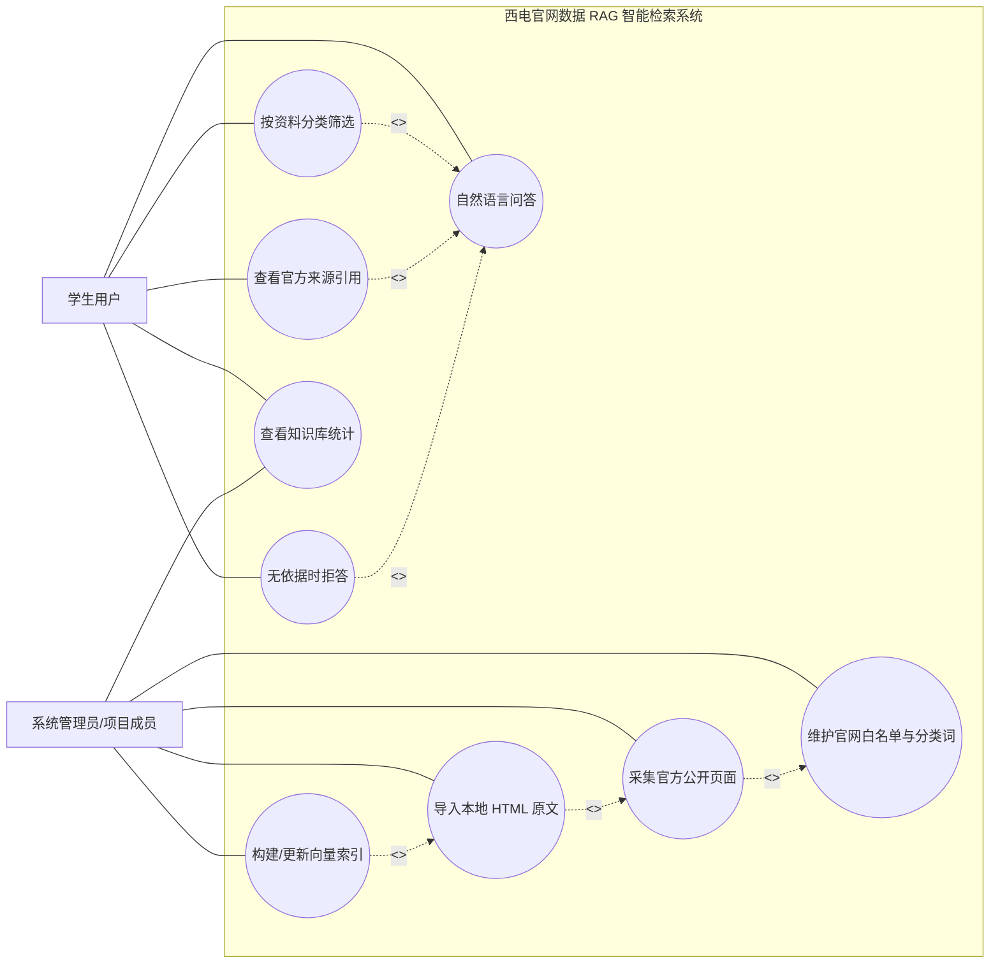
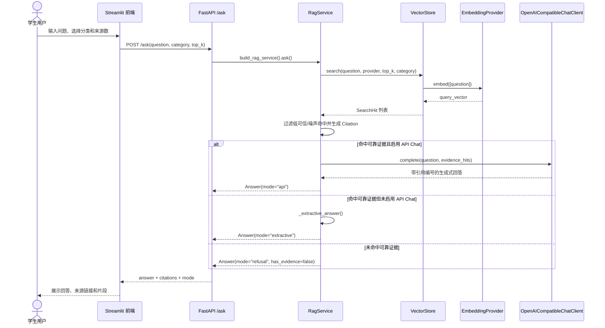
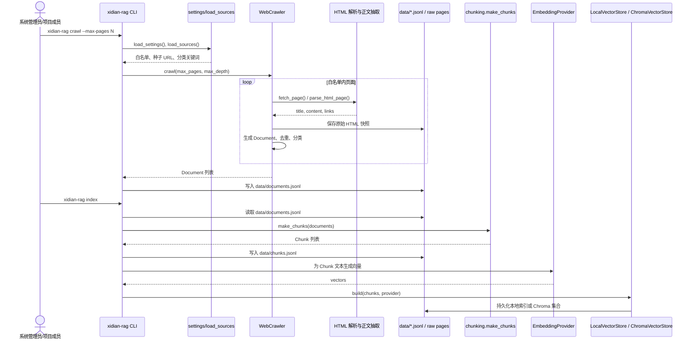
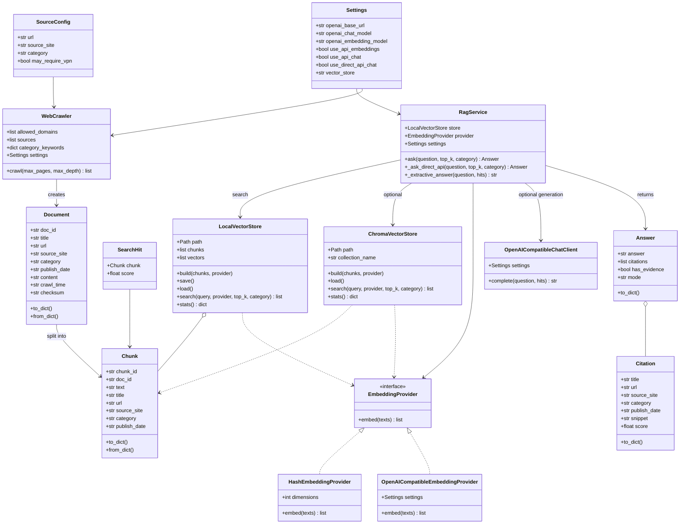
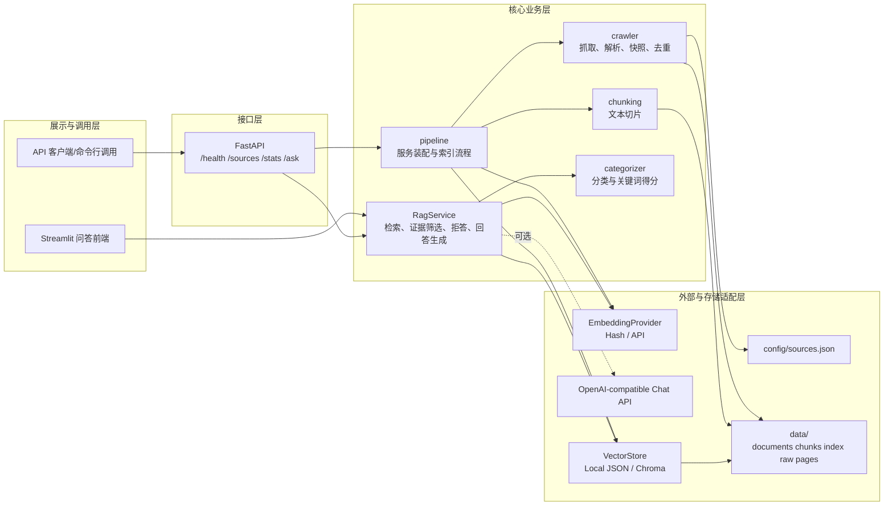

# 西电官网数据 RAG 智能检索系统 UML 图例

本文档整理项目报告可直接引用的 UML/流程图例。图例使用 Mermaid 编写，便于后续在 Markdown、Mermaid Live Editor、draw.io 或 VS Code 插件中导出为 PNG/SVG 后插入 Word/PDF。

## SVG 图文件

以下 SVG 已按 16:9 幻灯片比例制作，可直接插入 PPT：

| 图例 | SVG 文件 | Mermaid 源文件 |
| --- | --- | --- |
| 用例图 | `docs/diagrams/use_case.svg` | `docs/diagrams/use_case.mmd` |
| 学生问答顺序图 | `docs/diagrams/ask_sequence.svg` | `docs/diagrams/ask_sequence.mmd` |
| 知识库构建顺序图 | `docs/diagrams/index_sequence.svg` | `docs/diagrams/index_sequence.mmd` |
| 核心类图 | `docs/diagrams/class_diagram.svg` | `docs/diagrams/class_diagram.mmd` |
| 系统组件图 | `docs/diagrams/component_diagram.svg` | `docs/diagrams/component_diagram.mmd` |

## 1. 用例图

## 2. 学生问答顺序图

## 3. 知识库构建顺序图

## 4. 核心类图

## 5. 系统组件图

